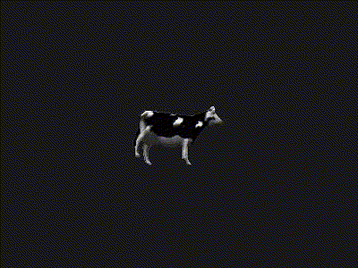

# Plankton
A small OpenGL game library made for educational purposes.\
\
\
(An [example app](https://github.com/hmsgobrr/planktest) using this library)\
\
This project is in early development stage.\
\
Since I'm still new to OpenGL, this library probably won't be as efficient as other.
But I still intend to make this library usable and also make it good enough to get in my top 5 game libraries to use.
If you're looking for a good game library, I recommend [raylib](https://www.raylib.com/), it's a really good game library
for those who enjoys programming.
## Usage
To use this library, if you use cmake you can add this repo to your project as a subdirectory and link the library like so:
```cmake
# CMakeLists.txt

add_subdirectory(path/to/plankton)
target_link_libraries(${PROJECT_NAME} plankton)
target_include_directories(${PROJECT_NAME} PRIVATE path/to/plankton/include path/to/plankton/vendor/spdlog)
```
Note that this project uses a third-party library, [spdlog](https://github.com/gabime/spdlog) for logging.\
\
Example Use (this creates a white empty window):
```cpp
#include "pt/plankton.h"

#define SCREEN_WIDTH  800
#define SCREEN_HEIGHT 450

int main() {
	pt::initWindow(SCREEN_WIDTH, SCREEN_HEIGHT, "Hello World!");

	while (!pt::windowShouldClose()) {
		pt::prepareFrame();

		pt::clearFrame({ 1.0f, 1.0f, 1.0f, 1.0f });

		// Drawing code goes here

		pt::display();
	}

	pt::shutdown();
	
	return 0;
}
```