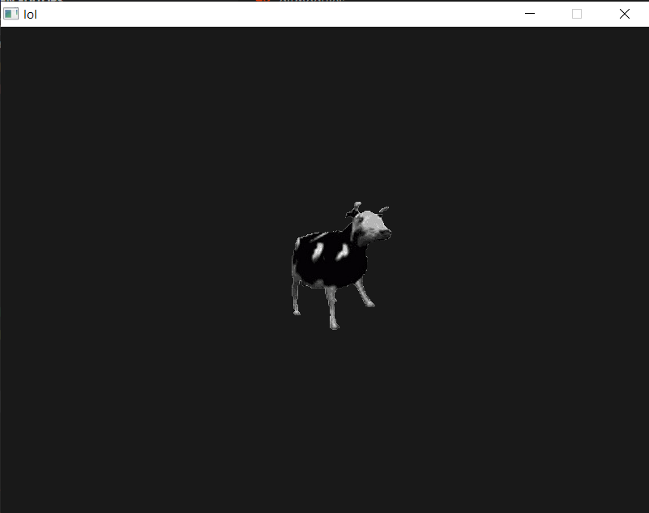

# Plankton
A small OpenGL game library made for educational purposes.\
\
This project is in early development stage.\
\
Since I'm still new to OpenGL, this library probably won't be as efficient as other.
But I still intend to make this library usable and also make it good enough to get in my top 5 game libraries to use.
## Usage
To use this library, if you use cmake you can add this repo to your project as a subdirectory and link the library like so:\
```cmake
# CMakeLists.txt

add_subdirectory(path/to/plankton)
target_link_libraries(${PROJECT_NAME} plankton)
target_include_directories(${PROJECT_NAME} PRIVATE path/to/plankton/include path/to/plankton/vendor/spdlog)
```
Note that this project uses a third-party library, [spdlog](https://github.com/gabime/spdlog) for logging.
